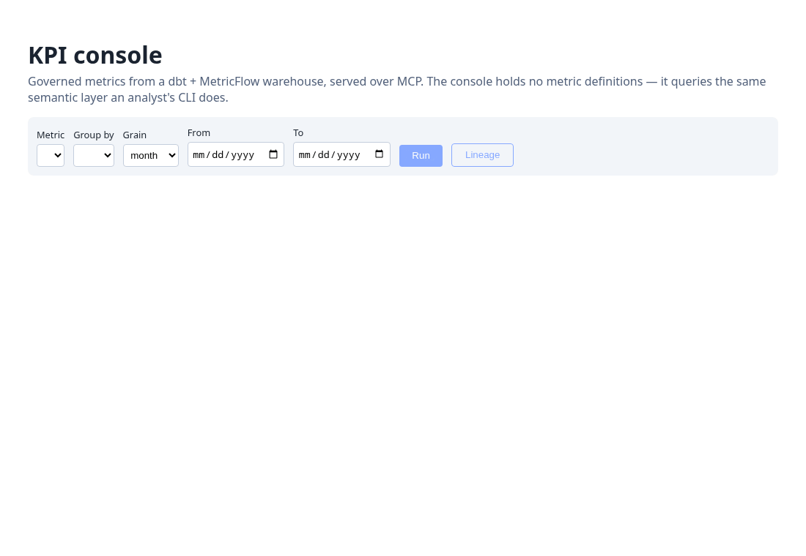

# kpi-console

> A SvelteKit console that is an MCP client of the
> [dbt-semantic-mcp](https://github.com/in-loop/dbt-semantic-mcp) warehouse: every number
> comes from the backend's single-sourced semantic layer (dbt + MetricFlow over MCP) —
> the console defines no metrics and composes no SQL. Catalog, query builder, SVG chart,
> lineage. Apache-2.0 OR MIT. Status: 0.1.0.



## What

SvelteKit server routes host an MCP client (`@modelcontextprotocol/sdk`, stdio) that
spawns the dbt-semantic-mcp server and calls its three tools: `list_metrics` populates
the catalog and group-by options, `query_metric` answers the query form, and
`describe_lineage` answers "where does this number come from". The browser talks only
to the console's `/api/*` routes; the warehouse file is never touched directly. The
chart is ~40 lines of SVG geometry (`src/lib/chart.ts`), no chart dependency. PWA
floor: manifest + icon, installable.

## Run

Requires Node 22+, [pnpm](https://pnpm.io/), [uv](https://docs.astral.sh/uv/), and a
checkout of dbt-semantic-mcp (0.1.0; brings its own Python pins) with a built warehouse:

```sh
git clone https://github.com/in-loop/dbt-semantic-mcp
(cd dbt-semantic-mcp && uv sync && cd warehouse && uv run dbt build)

git clone https://github.com/in-loop/kpi-console && cd kpi-console
pnpm install
DBT_SEMANTIC_MCP_DIR=../dbt-semantic-mcp pnpm dev
```

Open http://localhost:5173 — pick a metric, a group-by, a grain, Run. The Lineage
button shows the dbt nodes behind the selected metric.

```sh
pnpm exec vitest run   # 5 unit tests (chart geometry, MCP content parsing)
pnpm run check         # svelte-check
pnpm exec biome check .
```

## Stack

SvelteKit 2 / Svelte 5 (runes) / TypeScript / Vite 8 · `@modelcontextprotocol/sdk`
(stdio client) · Biome + svelte-check · vitest. No UI framework, no chart library,
no ORM — the backend's semantic layer is the data model.

## Limits

- Requires a local dbt-semantic-mcp checkout; there is no hosted backend. The MCP
  server is spawned per console process and reused across requests.
- CI runs lint/typecheck/unit tests with no Python backend; the end-to-end path is
  exercised locally (the demo GIF above is a frame-capture walkthrough from a live run).
- One chart shape (bars). Multi-metric queries are supported by the API route but the
  form submits one metric at a time.
- MetricFlow's `--where` filters are not exposed (the backend omits them by design).

## Development

```sh
pre-commit install   # one-time after clone
just check           # fmt + lint + test
```

## License

Licensed under either of:

- Apache License, Version 2.0 ([LICENSE-APACHE](LICENSE-APACHE) or
  <http://www.apache.org/licenses/LICENSE-2.0>)
- MIT license ([LICENSE-MIT](LICENSE-MIT) or
  <http://opensource.org/licenses/MIT>)

at your option.

### Contribution

Unless you explicitly state otherwise, any contribution intentionally
submitted for inclusion in this project by you, as defined in the
Apache-2.0 license, shall be dual licensed as above, without any
additional terms or conditions.
